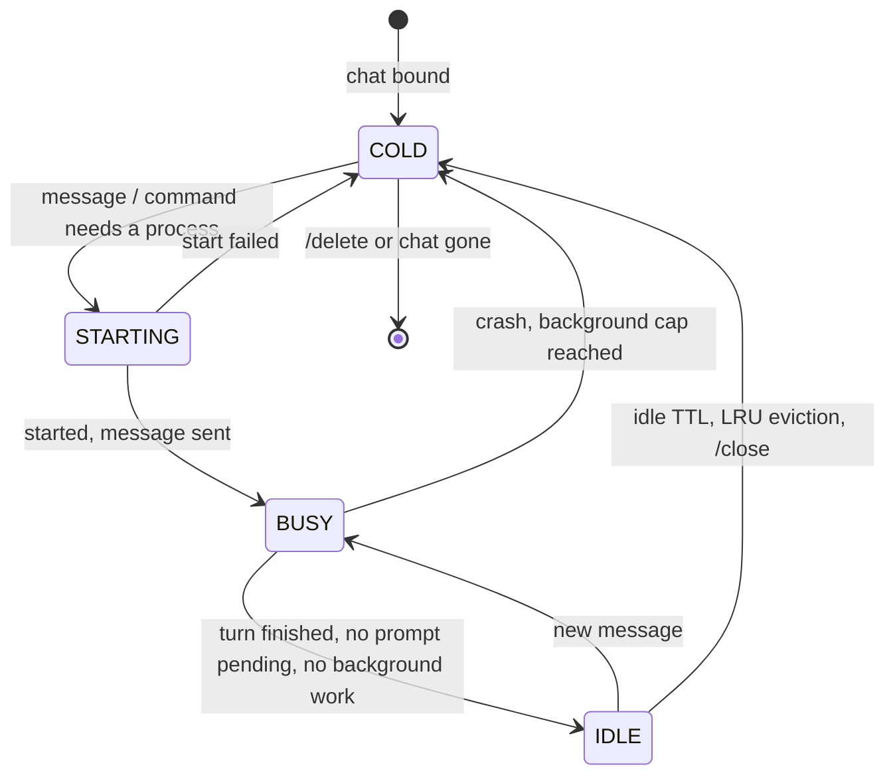
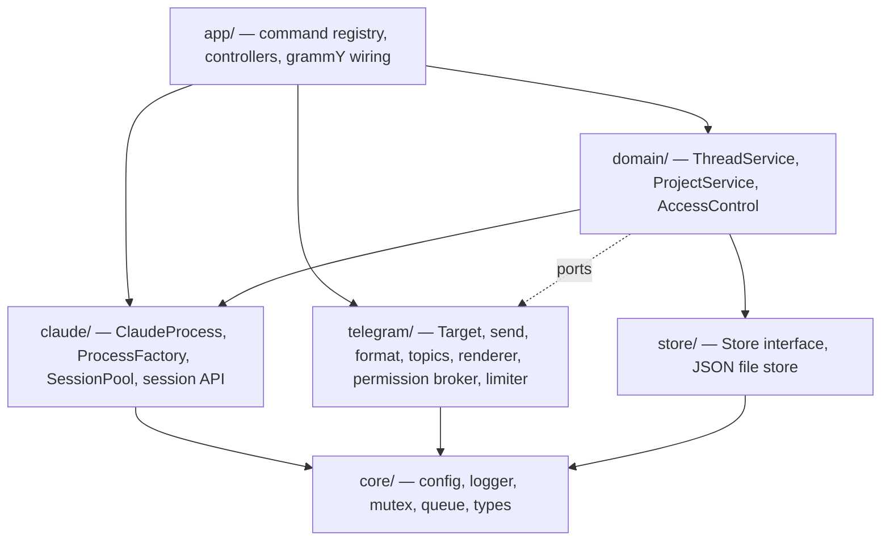

# tg-cc-bot architecture

tg-cc-bot lets a Telegram private chat drive Claude Code on a server. With Threaded Mode enabled, the
bot's conversation is split into **chats** (Telegram topics in a private chat). Every message typed on
the bot's main screen opens a new chat. **Each chat is one Claude Code session** working in a chosen
**project**. Bot commands are mechanical (no Claude involved) and work in every chat.

This document describes the design. It is the reference for anyone changing the code: when the code and
this document disagree, fix one of them.

---

## 1. Goals and non-goals

**Goals**

1. One chat = one Claude Code session, running in a project directory, with everything Claude Code
   loads there: skills, `CLAUDE.md`, MCP servers, hooks, plugins, settings.
2. Bot mechanics (projects, defaults, session overview, status, per-chat settings) are slash commands
   that never involve Claude and work in any chat. A chat used only for such commands does not become
   a session.
3. Users not in the allowlist learn their Telegram user ID and nothing else.
4. Bounded resource use. Sessions can be picked up and put down at any time, like `claude --resume`,
   without keeping a process alive for every session.
5. Robust under concurrency (several chats streaming at once), restarts and crashes; easy to extend.

**Non-goals (for now)**

- Group chats and channels. The bot ignores them.
- Several bot instances sharing one token. Telegram allows only one poller per token.
- Running the same session from the bot and a terminal at the same time.

---

## 2. Concepts

| Concept | What it is | Lifetime | Where it lives |
|---|---|---|---|
| **User space** | Everything between one allowed user and the bot (Telegram's private chat) | Permanent | `state.chats[chatId]`: active project, defaults |
| **Chat** | A topic in that private chat (`message_thread_id`). Opened by typing on the bot's main screen, or by the bot for `/resume` and `/fork` | Until the user deletes it or sends `/delete` | `state.chats[chatId].threads[threadId]`, created when the chat first needs a session |
| **Project** | A named working directory (workspace) | Until removed | `state.projects[name]` |
| **Session** | A Claude Code conversation, identified by a UUID | Permanent (transcript on disk) | `~/.claude/projects/<dir>/<sessionId>.jsonl` (owned by Claude Code) |
| **Process** | A running Claude Code process serving one session | Minutes; disposable | memory only (`SessionPool`) |

Relations:

```
User space 1 ──── * Chat 1 ──── 1 Session ──── 0..1 Process
                     │
                     └── project (name + cwd, fixed once the session starts)
User space ─── activeProject ──► Project
```

The chat ↔ session mapping (`ThreadService`):

- **Key.** A chat is identified by `chatId:threadId`. Its record holds the current `sessionId`, whether
  the transcript exists (`started`), the working directory and the per-chat settings (model, permission
  mode, effort, verbose). The process pool and the permission broker use the same key.
- **Lazy binding.** A record is created the first time the chat needs a session: its first message to
  Claude, or a per-chat setting such as `/model`. The session UUID is generated then
  (`Options.sessionId`). Chats used only for bot commands get no record.
- **One current session per chat.** `/clear` (or "clear context" when leaving plan mode) starts a new
  conversation, and the chat follows it. The old transcript stays resumable.
- **One chat per session.** Resuming a session that already has a chat points to that chat instead of
  opening a duplicate.
- **Fixed directory.** Until the session starts, `/project use` also moves the chat. After that the
  directory is fixed, and `/project use` only changes where new chats start.
- **Deleting.** Deleting a chat removes the mapping only; the transcript stays on disk and `/resume`
  can open it again.

---

## 3. User-facing behaviour

### 3.1 Access

- `ALLOWED_USER_IDS` (in `.env`) is the allowlist. All allowed users are trusted equally.
- Any other user writing to the bot gets one reply in the chat they wrote in: their numeric user ID and
  a note to ask the owner to add it. The reply is rate-limited to once per user every 10 minutes.
- Group, supergroup and channel updates are ignored.

### 3.2 Bot commands (mechanical, in every chat)

Session commands act on the chat they are sent in:

| Command | Effect |
|---|---|
| `/stop` | Interrupt the running turn, cancel pending prompts and a message still waiting for a slot |
| `/model [name]`, `/mode [mode]`, `/effort [level]` | Show (buttons) or change this chat's setting. Persisted, applied live, and usable before the first message |
| `/verbose` | Toggle tool output and timings for this chat |
| `/rename <title>` | Rename the session and the chat |
| `/fork` | Open a new chat with a fork of this session |
| `/close` | Hibernate now: stop the process, keep the chat |
| `/delete` | After confirmation: hibernate and delete the chat with its messages. The transcript stays resumable |

Bot-wide commands:

| Command | Effect |
|---|---|
| `/start`, `/help` | How the bot works and the command list. Warns if Threaded Mode is off |
| `/status` | This chat's session (ID, project, settings, process state, context usage) plus the bot: live processes, waiting turns, memory, Claude Code version |
| `/sessions` | Chats with a session and their state (🟢 busy, 🟡 idle, ⚪ hibernated); buttons post a "👋" into a chat to jump there |
| `/resume [all\|id]` | Pick a past session (active project, all projects, or by ID) and open it in a new chat |
| `/projects` | List projects with the active one marked; buttons switch it |
| `/project add <name> <path>` | Register a project (must exist, be a directory, be inside `ALLOWED_ROOTS` if set, be writable) and make it active |
| `/project use <name>` | Make it active for new chats, and for this chat if its session has not started |
| `/project rm <name>` | Remove a project. Chats that use it keep working in their directory |
| `/settings` | Defaults for new chats: model, permission mode, effort, verbose |

Any other `/command` goes to Claude Code unchanged: `/compact`, `/context`, `/usage`, `/clear`,
skills, plugin commands. The Telegram menu spells `code-review` as `code_review`; the bot maps menu
spellings back.

### 3.3 Opening chats

- **Typing on the bot's main screen** opens a new chat. Telegram sends `forum_topic_created` (the bot
  only remembers the name) and the message itself. The first message to Claude binds the chat to the
  active project, posts one line (`📁 project · cwd · new session`) and starts the session.
- **`/resume`** opens the chosen session in a new chat (`createForumTopic`), named after the session,
  with a short recap of the last exchange.
- **`/fork`** forks the transcript (`forkSession`) and opens it in a new chat.
- There is no `/new`: going back to the main screen and typing is the new-chat gesture.

**Titles.** A chat whose name Telegram marks as implicit is renamed after its first prompt (first
line, at most 40 characters). Names the user typed, or later renames by the user
(`forum_topic_edited`), are never overwritten by the bot.

**Outside chats.** Without Threaded Mode every message arrives without a `message_thread_id`. The bot
then answers with how to enable Threaded Mode and starts no session. Bot commands still work.

---

## 4. Session lifecycle

### 4.1 Sessions are not processes

A Claude Code process holds exactly one conversation; the Agent SDK's `query()` starts one process.
The conversation's durable state is its transcript, which Claude Code writes to disk. So a process is a
**cache** of a session and can be dropped at any time and recreated with `resume: <sessionId>`.

- Only sessions that are actively working need a process.
- Idle sessions are **hibernated**: their process is closed.
- The next message **resumes** transparently. A cold start plus resume took 0.5–1.5 s in tests. Prompt
  caching is server-side and does not depend on the process.

### 4.2 States



A process is **BUSY** while any of these hold:

- a turn is running (from sending a message until its `result`);
- a permission or question prompt from this session is waiting for the user;
- non-ambient background tasks are alive (from `background_tasks_changed`): background shells,
  subagents, monitors. Closing the process would kill them.

BUSY processes are never evicted.

### 4.3 Pool policy

| Setting | Default | Meaning |
|---|---|---|
| `MAX_LIVE_SESSIONS` | 3 | Maximum Claude Code processes at the same time |
| `SESSION_IDLE_MINUTES` | 15 | Close a process after this long IDLE |
| `BACKGROUND_MAX_MINUTES` | 120 | Close a process kept alive only by background tasks after this long |

**Admission.** When a session needs a process and the pool is full:

1. evict the least recently used IDLE process;
2. if every process is BUSY, the request waits in a FIFO queue. The chat shows
   "⏳ waiting for a free slot". `/stop` in that chat cancels the wait. Slots are handed to waiters as
   soon as any process closes.

Slots are reserved synchronously before any `await`, so concurrent starts can never exceed the limit.

**Settings that live inside the process** (model, permission mode, effort) are written to the chat's
record *before* being applied to a live process, and passed again on every resume. Hibernation never
loses them.

### 4.4 Failure handling

| Event | Handling |
|---|---|
| Process crashes | Session goes COLD, pending prompts are denied, the chat gets a notice. The next message resumes |
| `auto` mode not available for the account or model | On the first `init`, the chat switches to `acceptEdits` (persisted) and says so once |
| Claude changes mode itself (e.g. leaving plan mode) | The new mode from the `status` message is persisted, so a resume keeps it |
| Resume fails because the transcript is gone | The chat gets a new session ID, the user is told it starts fresh, and the message is sent there |
| Start times out (60 s) | Slot released, error shown in the chat |
| Bot restarts | Everything starts COLD; chats and settings come back from the state file |
| Shutdown (SIGTERM) | Stop polling, deny pending prompts, close processes (resumable), flush state |

---

## 5. Architecture

### 5.1 Layers



Dependency rules:

- `claude/` never imports grammY; `telegram/` never starts Claude processes.
- `domain/` reaches Telegram only through small ports (for example `TopicGateway`), so its tests need
  neither the network nor the SDK.
- `index.ts` is the only place that builds concrete objects (composition root).

### 5.2 Modules

```
src/
  index.ts                composition root, startup, shutdown
  core/
    config.ts             environment configuration and validation
    logger.ts             levelled, scoped logger (one line per event, journald friendly)
    mutex.ts              KeyedMutex: serialises work per key
    queue.ts              AsyncQueue: push-based async iterable (streaming input)
    types.ts              Target, ThreadKey, records, Effort
  store/
    store.ts              Store interface, JsonFileStore (versioned, atomic, debounced)
  claude/
    process.ts            ProcessHandle + ProcessFactory interfaces; SdkProcess / SdkProcessFactory (one query() each)
    pool.ts               SessionPool: states, admission, eviction, timers, stats
    sessions.ts           SessionApi: list / info / fork / rename / recap over the SDK session store
    catalog.ts            CommandCatalog: Claude commands and models (startup probe, live updates)
    cmdnames.ts           Claude ↔ Telegram command-name mapping, command parsing
  telegram/
    target.ts             Target helpers: thread parameters, classification of updates
    send.ts               send/edit/markdown/draft/typing; error classification
    format.ts             Markdown → Telegram HTML, fence-safe splitting
    topics.ts             create/rename/delete topics, titles
    render.ts             TurnRenderer: one per chat, turns SDK messages into Telegram messages
    permissions.ts        PermissionBroker: canUseTool → buttons, per chat
    limiter.ts            per-chat budget for best-effort traffic (drafts, status edits)
    media.ts              photo/document download
    tools.ts              tool icons and one-line summaries
  domain/
    chats.ts              ChatService: per-chat active project and defaults
    projects.ts           ProjectService: validation, active project
    threads.ts            ThreadService: chats ↔ sessions ↔ processes (+ TopicGateway port)
    access.ts             AccessControl
    errors.ts             UserError: expected failures shown to the user as is
  app/
    registry.ts           CommandRegistry (every command in every chat) and CallbackRouter
    context.ts            App (services handed to handlers), RendererRegistry
    views.ts              shared HTML pieces: chat headers, keyboards, replies
    control.ts            bot-wide commands and buttons (/help, /status, /projects, /resume …)
    thread.ts             chat ↔ session: lazy binding, message handling, session commands, passthrough
    bot.ts                createApp(): wiring, access gate, error boundary, routing; syncMenu()
scripts/
  topics-spike.ts         checks private-chat topics against the real Bot API
```

### 5.3 Key interfaces

```ts
// claude/process.ts: one Claude Code process serving one session
interface ProcessSpec { sessionId: string; resume: boolean; cwd: string;
                        model?: string; permissionMode: PermissionMode; effort?: Effort }
interface ProcessHandle {
  readonly sessionId: string;          // follows conversation resets
  readonly turnActive: boolean;
  readonly backgroundTasks: number;
  start(): Promise<void>;              // spawn + initialise (timeout)
  send(content: UserContent): void;
  interrupt(): Promise<void>;
  setModel(m?: string): Promise<void>;
  setPermissionMode(m: PermissionMode): Promise<void>;
  setEffort(e?: Effort): Promise<void>;
  contextUsage(): Promise<ContextUsage | null>;
  close(): Promise<void>;
}
interface ProcessFactory { create(spec: ProcessSpec, hooks: ProcessHooks): ProcessHandle }

// claude/pool.ts: keyed by an opaque string (the chat key)
class SessionPool {
  state(key): "cold" | "starting" | "idle" | "busy";
  send(key, spec: () => ProcessSpec, content): Promise<void>;
  ensure(key, spec): Promise<ProcessHandle>;
  setBlocked(key, delta): void;        // pending prompts
  interrupt(key), cancelWaiting(key), hibernate(key), shutdown(), stats();
}
```

The pool takes the spec as a *function*, so a restart always reads the chat's latest persisted settings.

---

## 6. Data model

`data/state.json` (written atomically: temp file + rename; debounced; serialised writes):

```ts
interface State {
  version: 1;
  projects: Record<string, { name: string; path: string; addedAt: number }>;
  chats: Record<string /* chatId */, {
    activeProject: string;
    defaults: { model?: string; permissionMode: PermissionMode; effort?: Effort; verbose: boolean };
    threads: Record<string /* threadId */, {
      threadId: number;
      sessionId: string;           // current session of the chat
      started: boolean;            // transcript exists → resume instead of create
      project: string; cwd: string;  // snapshot at creation
      title: string; titleSource: "placeholder" | "auto" | "user";
      model?: string; permissionMode: PermissionMode; effort?: Effort; verbose: boolean;
      createdAt: number; lastActiveAt: number;
    }>;
  }>;
}
```

- Bootstrap: with no projects, a project `home` is created from `DEFAULT_CWD`.
- A record exists only for chats that needed a session. Records that never started one (for example a
  chat where only `/model` was set) are pruned at startup after 7 days.
- A corrupt state file is moved aside (`state.json.corrupt-<time>`) and the bot starts empty, logging a
  warning, instead of refusing to start.
- Session transcripts are owned by Claude Code and are never written by the bot.

---

## 7. Flows

**Message in a chat**

1. `bot.ts` classifies the update (chat, thread). Updates of the same chat are processed in order;
   different chats run concurrently.
2. `ThreadService.send(key, content)` runs under the chat's mutex. The handler does not wait for it, so
   `/stop` in the same chat stays responsive.
3. `SessionPool.send`: the process is reused if it is live; otherwise a slot is reserved and the process
   starts (or resumes) from the chat's spec.
4. SDK messages flow `pool → ThreadService.observe` (session ID, `started`, activity) and
   `→ TurnRenderer` (preview, tool status, final reply).
5. `result`: the turn ends. If nothing else keeps the session BUSY, the idle timer starts.

**Eviction and resume.** The idle timer fires, or the LRU entry is evicted for another chat. The process
closes and the state becomes COLD. Nothing is sent to the user. The next message runs the start path
with `resume: true`.

**Permission prompt.** Claude Code calls `canUseTool` and the broker posts buttons in that chat. The pool
marks the session blocked (BUSY). The answer resolves the callback and unblocks. Free text in the chat
while a prompt is open answers a question or denies with feedback. The prompt is denied automatically
after `PERMISSION_TIMEOUT_MS`.

**Chat deleted by the user.** Telegram sends no update for this. The next send to the chat fails with
"message thread not found". The chat is unbound and its process hibernated; this is logged (there is
no chat left to report it in). The session stays resumable.
The session stays resumable.

**Unknown user.** The access middleware stops the update and (rate-limited) replies with the user ID.

---

## 8. Concurrency model

- Updates: `@grammyjs/runner` with `sequentialize` keyed by `chatId:threadId` (`main` outside chats).
  Order is kept within a chat; different chats run concurrently.
- Chat state changes (start, send, settings, fork, delete): `KeyedMutex` per chat key in
  `ThreadService`.
- Turns are fire-and-forget from the handler's point of view; errors are reported to the chat.
- Pool admission: synchronous slot accounting plus a FIFO of waiters.
- Telegram rate limits: `@grammyjs/auto-retry` retries 429/5xx for essential calls. Best-effort traffic
  (drafts, status edits) goes through a per-chat budget, because several chats stream into the same chat,
  and is skipped when over budget. Final replies are always sent, in order, per chat.

---

## 9. Telegram specifics

- Threaded Mode must be enabled in @BotFather (`getMe().has_topics_enabled`). The bot checks this at
  startup and reports it in `/help`, `/status` and the logs. Without it no session can start.
- `allows_users_to_create_topics = false` stops users from opening new chats; then only `/resume` and
  `/fork` (which the bot opens itself) create sessions. `/help` and `deploy.sh check` warn about it.
- A message without a thread (or in the General thread `1`) is outside any chat and never starts a
  session. Messages to it are sent without `message_thread_id`.
- Bot command menus are scoped per private chat, not per topic, so every chat shows the same menu: bot
  commands plus Claude Code's. That is also why every bot command works in every chat.
- Markdown is converted to Telegram HTML. If Telegram rejects the markup, the message is resent as plain
  text. Long replies are split fence-safely, and very long ones are sent as a `.md` file.
- Live previews use `sendMessageDraft` and fall back to editing a placeholder message.

---

## 10. Configuration

See `.env.example`. Notable keys:

- `TELEGRAM_BOT_TOKEN`, `ALLOWED_USER_IDS`: required.
- `DEFAULT_CWD`: bootstrap project. `ALLOWED_ROOTS`: where projects may live.
- `DEFAULT_MODEL`, `DEFAULT_PERMISSION_MODE`: initial defaults for new chats.
- `MAX_LIVE_SESSIONS`, `SESSION_IDLE_MINUTES`, `BACKGROUND_MAX_MINUTES`: process lifecycle.
- `PERMISSION_TIMEOUT_MS`, `STREAM_MODE`, `STATE_FILE`, `CLAUDE_PATH`, `LOG_LEVEL`.
- Claude authentication: the service user's `claude` login, or `CLAUDE_CODE_OAUTH_TOKEN`.

---

## 11. Extension points

| Want to… | Extend |
|---|---|
| Hide cold-start latency | A `ProcessFactory` backed by the SDK's `prewarm()` spare process |
| Store state in SQLite | Another `Store` implementation |
| Add a command | `registry.register({ name, scope, description, handler })` in `app/main.ts` or `app/thread.ts`. Help and menu update automatically |
| Add buttons | `callbacks.on(prefix, handler)`; callback data is `prefix:payload` (≤ 64 bytes) |
| Change how output looks | `TurnRenderer` only; nothing else formats SDK messages |
| Per-project defaults | Extend `ProjectRecord` and `ThreadService.specFor()` |
| Another chat platform | Re-implement `telegram/` + `app/`; `claude/`, `domain/`, `store/` stay |

---

## 12. Testing strategy

- **Unit:** format, command names, queue, mutex, config, store (atomic write, corrupt file), target
  classification, registry routing.
- **Pool:** a fake `ProcessFactory` drives every lifecycle rule: LRU eviction, idle TTL, BUSY protection
  (turns, prompts, background tasks), admission queue and `/stop` cancellation, crash → COLD → resume
  with persisted settings, shutdown.
- **Domain:** ThreadService invariants with an in-memory store, the fake factory and a fake
  `TopicGateway`.
- **Controllers:** `bot.handleUpdate()` with an API transformer that records outgoing calls: chat
  routing, unknown users, new chats bind to the active project on first use, command-only chats leave no
  record, `/project use` before and after a session starts, chat-gone handling.
- **Live:** a smoke script against real Claude Code (two sessions, `MAX_LIVE_SESSIONS=1`, transparent
  resume) and `scripts/topics-spike.ts` against the real Bot API.

---

## 13. Decisions and risks

| Decision | Reason |
|---|---|
| Chat ⇔ session, project fixed once the session starts | Matches Claude Code's model (a session belongs to a directory); keeps `cwd` stable for the transcript |
| Hibernate + transparent resume, bounded pool | Bounded RAM and usage; picking up and putting down sessions works like `claude --resume` |
| Pre-generated session UUID (`Options.sessionId`) | The chat is bound before Claude answers; nothing depends on parsing `init` |
| Allowlist only in `.env` | Simple trust model; changes go through the deploy script |
| Bot commands mechanical and available in every chat | Telegram's Threaded Mode has no main view to type into: every message opens or belongs to a chat |
| Chat bound on first use, project switchable until then | Command-only chats leave nothing behind; `/project use` before talking puts the session where it belongs |
| No `/new` | Typing on the bot's main screen already opens a new chat |
| Fire-and-forget turns plus a per-chat mutex | Ordered messages and responsive `/stop` at the same time |

Risks:

- **Private-chat topics are new** (Bot API 9.3, December 2025). A May 2026 report
  (tdlib/telegram-bot-api#847, closed) described `message thread not found` errors.
  `scripts/topics-spike.ts` verifies the real behaviour before deployment.
- **Agent SDK billing** for subscription users may change (a separate SDK credit was announced, then
  paused).
- Scheduled wake-ups inside a session (`/loop`, cron tools) do not survive hibernation.
