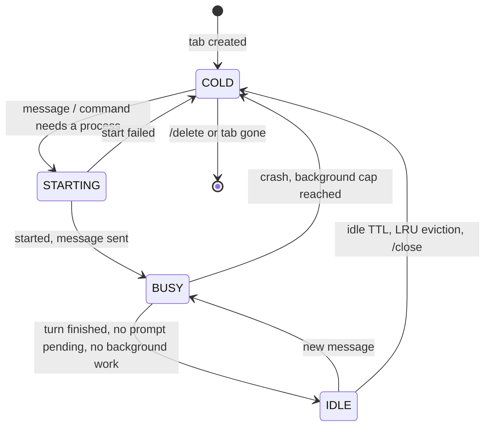
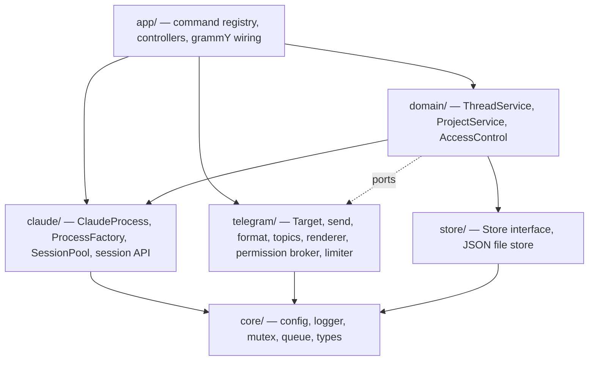

# tg-cc-bot architecture

tg-cc-bot lets a Telegram private chat drive Claude Code on a server. Each **tab** of the chat
(Telegram's topics in private chats) is one **Claude Code session** working in a chosen **project**.
The chat's **main view** is a command-only control panel.

This document describes the design. It is the reference for anyone changing the code: when the code and
this document disagree, fix one of them.

---

## 1. Goals and non-goals

**Goals**

1. One tab = one Claude Code session, running in a pre-selected project directory, with everything
   Claude Code loads there: skills, `CLAUDE.md`, MCP servers, hooks, plugins, settings.
2. The main view only handles bot mechanics (projects, defaults, session overview, status) and only
   through commands. Claude never talks there.
3. Users not in the allowlist learn their Telegram user ID and nothing else.
4. Bounded resource use. Sessions can be picked up and put down at any time, like `claude --resume`,
   without keeping a process alive for every session.
5. Robust under concurrency (several tabs streaming at once), restarts and crashes; easy to extend.

**Non-goals (for now)**

- Group chats and channels. The bot ignores them.
- Several bot instances sharing one token. Telegram allows only one poller per token.
- Running the same session from the bot and a terminal at the same time.

---

## 2. Concepts

| Concept | What it is | Lifetime | Where it lives |
|---|---|---|---|
| **Chat** | The private chat between one allowed user and the bot | Permanent | `state.chats[chatId]` |
| **Main view** | Messages in the chat that are not in a tab (no `message_thread_id`, or the General thread `1`) | Permanent | none |
| **Tab** | A Telegram topic in the private chat (`message_thread_id`) | Until the user deletes it or sends `/delete` | `state.chats[chatId].threads[threadId]` |
| **Project** | A named working directory (workspace) | Until removed | `state.projects[name]` |
| **Session** | A Claude Code conversation, identified by a UUID | Permanent (transcript on disk) | `~/.claude/projects/<dir>/<sessionId>.jsonl` (owned by Claude Code) |
| **Process** | A running Claude Code process serving one session | Minutes; disposable | memory only (`SessionPool`) |

Relations:

```
Chat 1 ──── * Tab 1 ──── 1 Session ──── 0..1 Process
              │
              └── project (snapshot: name + cwd at creation)
Chat ─── activeProject ──► Project
```

- A tab maps to exactly one *current* session. `/clear` (or "clear context" when leaving plan mode)
  starts a new conversation, and the tab follows it. The old transcript stays resumable.
- A session is bound to at most one tab. Resuming a session that already has a tab points to that tab
  instead of opening a duplicate.
- A tab's working directory is fixed when the tab is created. To work in another project, switch the
  active project in the main view and open a new tab.

---

## 3. User-facing behaviour

### 3.1 Access

- `ALLOWED_USER_IDS` (in `.env`) is the allowlist. All allowed users are trusted equally.
- Any other user writing to the bot in a private chat gets one reply: their numeric user ID and a note
  to ask the owner to add it. The reply is rate-limited to once per user every 10 minutes.
- Group, supergroup and channel updates are ignored.

### 3.2 Main view (commands only)

| Command | Effect |
|---|---|
| `/start`, `/help` | Help for the current context. Warns if Threaded Mode is off in @BotFather |
| `/projects` | List projects with the active one marked; buttons switch the active project |
| `/project add <name> <path>` | Register a project. The path must exist, be a directory, be inside `ALLOWED_ROOTS` (if set) and be writable by the bot |
| `/project use <name>` | Set the active project for new tabs |
| `/project rm <name>` | Remove a project. Existing tabs keep working in their directory |
| `/new [title]` | Create a tab in the active project with a fresh session |
| `/resume [all]` | Pick a past session (active project, or all projects) and open it in a tab |
| `/sessions` | Tabs and their state (🟢 busy, 🟡 idle, ⚪ hibernated), with buttons to jump to a tab |
| `/settings` | Defaults for new tabs: model, permission mode, effort, verbose |
| `/status` | Live processes, waiting turns, memory, Claude Code version, Threaded Mode status |

Text, photos and files in the main view get a short hint pointing to `/new` or an existing tab.

### 3.3 Tabs

Text, photos and files go to the tab's Claude session. Commands handled by the bot:

| Command | Effect |
|---|---|
| `/stop` | Interrupt the running turn, cancel pending prompts and queued messages of this tab |
| `/model [name]`, `/mode [mode]`, `/effort [level]` | Show (buttons) or change this tab's setting. Persisted and applied live |
| `/verbose` | Toggle tool output and timings for this tab |
| `/status` | Session ID, title, project, process state, context usage |
| `/rename <title>` | Rename the session and the tab |
| `/fork` | Open a new tab with a fork of this session |
| `/close` | Hibernate now: stop the process, keep the tab |
| `/delete` | After confirmation: hibernate and delete the tab with its messages. The transcript stays resumable |
| `/new`, `/resume` | Open another tab, same as in the main view |
| `/help` | Help for tabs |

Any other `/command` goes to Claude Code unchanged: `/compact`, `/context`, `/usage`, `/clear`,
skills, plugin commands. The Telegram menu spells `code-review` as `code_review`. The bot maps menu
spellings back. Commands used in the wrong place get a one-line redirect.

### 3.4 Opening tabs

- **`/new`**: the bot creates the topic (`createForumTopic`), generates the session UUID, stores the tab,
  and posts a header (`📁 project · new session`).
- **Telegram's "+" button**: the bot receives `forum_topic_created` (or, if that was missed, the first
  message in an unknown thread). It binds the tab to the chat's active project and posts the same header.
- **`/resume`**: opens the chosen session in a new tab, named after the session, with a short recap of
  the last exchange. If the session already has a tab, the bot posts "👋 here" in that tab instead.
- **`/fork`**: forks the transcript (`forkSession`) and opens it in a new tab.

**Titles.** A tab created without an explicit name (`/new` without a title, or a "+" tab whose name is
implicit) is renamed after its first prompt (first line, at most 40 characters). Names the user typed,
or later renames by the user (`forum_topic_edited`), are never overwritten by the bot.

---

## 4. Session lifecycle

### 4.1 Sessions are not processes

A Claude Code process holds exactly one conversation; the Agent SDK's `query()` starts one process.
The conversation's durable state is its transcript, which Claude Code writes to disk. So a process is a
**cache** of a session and can be dropped at any time and recreated with `resume: <sessionId>`.

- Only sessions that are actively working need a process.
- Idle sessions are **hibernated**: their process is closed.
- The next message **resumes** transparently. A cold start plus resume took 0.5–1.5 s in tests. Prompt
  caching is server-side and does not depend on the process.

### 4.2 States



A process is **BUSY** while any of these hold:

- a turn is running (from sending a message until its `result`);
- a permission or question prompt from this session is waiting for the user;
- non-ambient background tasks are alive (from `background_tasks_changed`): background shells,
  subagents, monitors. Closing the process would kill them.

BUSY processes are never evicted.

### 4.3 Pool policy

| Setting | Default | Meaning |
|---|---|---|
| `MAX_LIVE_SESSIONS` | 3 | Maximum Claude Code processes at the same time |
| `SESSION_IDLE_MINUTES` | 15 | Close a process after this long IDLE |
| `BACKGROUND_MAX_MINUTES` | 120 | Close a process kept alive only by background tasks after this long |

**Admission.** When a session needs a process and the pool is full:

1. evict the least recently used IDLE process;
2. if every process is BUSY, the request waits in a FIFO queue. The tab shows
   "⏳ waiting for a free slot". `/stop` in that tab cancels the wait. Slots are handed to waiters as
   soon as any process closes.

Slots are reserved synchronously before any `await`, so concurrent starts can never exceed the limit.

**Settings that live inside the process** (model, permission mode, effort) are written to the tab's
record *before* being applied to a live process, and passed again on every resume. Hibernation never
loses them.

### 4.4 Failure handling

| Event | Handling |
|---|---|
| Process crashes | Session goes COLD, pending prompts are denied, the tab gets a notice. The next message resumes |
| `auto` mode not available for the account or model | On the first `init`, the tab switches to `acceptEdits` (persisted) and says so once |
| Claude changes mode itself (e.g. leaving plan mode) | The new mode from the `status` message is persisted, so a resume keeps it |
| Resume fails because the transcript is gone | The tab gets a new session ID, the user is told it starts fresh, and the message is sent there |
| Start times out (60 s) | Slot released, error shown in the tab |
| Bot restarts | Everything starts COLD; tabs and settings come back from the state file |
| Shutdown (SIGTERM) | Stop polling, deny pending prompts, close processes (resumable), flush state |

---

## 5. Architecture

### 5.1 Layers



Dependency rules:

- `claude/` never imports grammY; `telegram/` never starts Claude processes.
- `domain/` reaches Telegram only through small ports (for example `TopicGateway`), so its tests need
  neither the network nor the SDK.
- `index.ts` is the only place that builds concrete objects (composition root).

### 5.2 Modules

```
src/
  index.ts                composition root, startup, shutdown
  core/
    config.ts             environment configuration and validation
    logger.ts             levelled, scoped logger (one line per event, journald friendly)
    mutex.ts              KeyedMutex: serialises work per key
    queue.ts              AsyncQueue: push-based async iterable (streaming input)
    types.ts              Target, ThreadKey, records, Effort
  store/
    store.ts              Store interface, JsonFileStore (versioned, atomic, debounced)
  claude/
    process.ts            ProcessHandle + ProcessFactory interfaces; SdkProcess / SdkProcessFactory (one query() each)
    pool.ts               SessionPool: states, admission, eviction, timers, stats
    sessions.ts           SessionApi: list / info / fork / rename / recap over the SDK session store
    catalog.ts            CommandCatalog: Claude commands and models (startup probe, live updates)
    cmdnames.ts           Claude ↔ Telegram command-name mapping, command parsing
  telegram/
    target.ts             Target helpers: thread parameters, classification of updates
    send.ts               send/edit/markdown/draft/typing; error classification
    format.ts             Markdown → Telegram HTML, fence-safe splitting
    topics.ts             create/rename/delete topics, titles
    render.ts             TurnRenderer: one per tab, turns SDK messages into Telegram messages
    permissions.ts        PermissionBroker: canUseTool → buttons, per tab
    limiter.ts            per-chat budget for best-effort traffic (drafts, status edits)
    media.ts              photo/document download
    tools.ts              tool icons and one-line summaries
  domain/
    chats.ts              ChatService: per-chat active project and defaults
    projects.ts           ProjectService: validation, active project
    threads.ts            ThreadService: tabs ↔ sessions ↔ processes (+ TopicGateway port)
    access.ts             AccessControl
    errors.ts             UserError: expected failures shown to the user as is
  app/
    registry.ts           CommandRegistry and CallbackRouter
    context.ts            App (services handed to handlers), RendererRegistry
    views.ts              shared HTML pieces: tab headers, keyboards, replies
    main.ts               main-view commands and buttons (+ /help, /new, /resume for both places)
    thread.ts             tab commands, buttons, message handling, passthrough
    bot.ts                createApp(): wiring, access gate, error boundary, routing; syncMenu()
scripts/
  topics-spike.ts         checks private-chat topics against the real Bot API
```

### 5.3 Key interfaces

```ts
// claude/process.ts: one Claude Code process serving one session
interface ProcessSpec { sessionId: string; resume: boolean; cwd: string;
                        model?: string; permissionMode: PermissionMode; effort?: Effort }
interface ProcessHandle {
  readonly sessionId: string;          // follows conversation resets
  readonly turnActive: boolean;
  readonly backgroundTasks: number;
  start(): Promise<void>;              // spawn + initialise (timeout)
  send(content: UserContent): void;
  interrupt(): Promise<void>;
  setModel(m?: string): Promise<void>;
  setPermissionMode(m: PermissionMode): Promise<void>;
  setEffort(e?: Effort): Promise<void>;
  contextUsage(): Promise<ContextUsage | null>;
  close(): Promise<void>;
}
interface ProcessFactory { create(spec: ProcessSpec, hooks: ProcessHooks): ProcessHandle }

// claude/pool.ts: keyed by an opaque string (the tab key)
class SessionPool {
  state(key): "cold" | "starting" | "idle" | "busy";
  send(key, spec: () => ProcessSpec, content): Promise<void>;
  ensure(key, spec): Promise<ProcessHandle>;
  setBlocked(key, delta): void;        // pending prompts
  interrupt(key), cancelWaiting(key), hibernate(key), shutdown(), stats();
}
```

The pool takes the spec as a *function*, so a restart always reads the tab's latest persisted settings.

---

## 6. Data model

`data/state.json` (written atomically: temp file + rename; debounced; serialised writes):

```ts
interface State {
  version: 1;
  projects: Record<string, { name: string; path: string; addedAt: number }>;
  chats: Record<string /* chatId */, {
    activeProject: string;
    defaults: { model?: string; permissionMode: PermissionMode; effort?: Effort; verbose: boolean };
    threads: Record<string /* threadId */, {
      threadId: number;
      sessionId: string;           // current session of the tab
      started: boolean;            // transcript exists → resume instead of create
      project: string; cwd: string;  // snapshot at creation
      title: string; titleSource: "placeholder" | "auto" | "user";
      model?: string; permissionMode: PermissionMode; effort?: Effort; verbose: boolean;
      createdAt: number; lastActiveAt: number;
    }>;
  }>;
}
```

- Bootstrap: with no projects, a project `home` is created from `DEFAULT_CWD`.
- A corrupt state file is moved aside (`state.json.corrupt-<time>`) and the bot starts empty, logging a
  warning, instead of refusing to start.
- Session transcripts are owned by Claude Code and are never written by the bot.

---

## 7. Flows

**Message in a tab**

1. `bot.ts` classifies the update (chat, thread). Updates of the same tab are processed in order;
   different tabs run concurrently.
2. `ThreadService.send(key, content)` runs under the tab's mutex. The handler does not wait for it, so
   `/stop` in the same tab stays responsive.
3. `SessionPool.send`: the process is reused if it is live; otherwise a slot is reserved and the process
   starts (or resumes) from the tab's spec.
4. SDK messages flow `pool → ThreadService.observe` (session ID, `started`, activity) and
   `→ TurnRenderer` (preview, tool status, final reply).
5. `result`: the turn ends. If nothing else keeps the session BUSY, the idle timer starts.

**Eviction and resume.** The idle timer fires, or the LRU entry is evicted for another tab. The process
closes and the state becomes COLD. Nothing is sent to the user. The next message runs the start path
with `resume: true`.

**Permission prompt.** Claude Code calls `canUseTool` and the broker posts buttons in that tab. The pool
marks the session blocked (BUSY). The answer resolves the callback and unblocks. Free text in the tab
while a prompt is open answers a question or denies with feedback. The prompt is denied automatically
after `PERMISSION_TIMEOUT_MS`.

**Tab deleted by the user.** Telegram sends no update for this. The next send to the tab fails with
"message thread not found". The tab is unbound, its process hibernated, and the main view gets a note.
The session stays resumable.

**Unknown user.** The access middleware stops the update and (rate-limited) replies with the user ID.

---

## 8. Concurrency model

- Updates: `@grammyjs/runner` with `sequentialize` keyed by `chatId:threadId` (`main` for the main view).
  Order is kept within a tab; tabs and chats are concurrent.
- Tab state changes (start, send, settings, fork, delete): `KeyedMutex` per tab key in
  `ThreadService`.
- Turns are fire-and-forget from the handler's point of view; errors are reported to the tab.
- Pool admission: synchronous slot accounting plus a FIFO of waiters.
- Telegram rate limits: `@grammyjs/auto-retry` retries 429/5xx for essential calls. Best-effort traffic
  (drafts, status edits) goes through a per-chat budget, because several tabs stream into the same chat,
  and is skipped when over budget. Final replies are always sent, in order, per tab.

---

## 9. Telegram specifics

- Threaded Mode must be enabled in @BotFather (`getMe().has_topics_enabled`). The bot checks this at
  startup and reports it in `/start`, `/status` and the logs. Without it only the main view works.
- `allows_users_to_create_topics = false` disables the "+" button; `/new` still works.
- The General thread (`1`) is the main view and is addressed without `message_thread_id`.
- Bot command menus are scoped per chat, not per topic, so the menu lists main, tab and Claude commands
  together. The registry answers commands used in the wrong place.
- Markdown is converted to Telegram HTML. If Telegram rejects the markup, the message is resent as plain
  text. Long replies are split fence-safely, and very long ones are sent as a `.md` file.
- Live previews use `sendMessageDraft` and fall back to editing a placeholder message.

---

## 10. Configuration

See `.env.example`. Notable keys:

- `TELEGRAM_BOT_TOKEN`, `ALLOWED_USER_IDS`: required.
- `DEFAULT_CWD`: bootstrap project. `ALLOWED_ROOTS`: where projects may live.
- `DEFAULT_MODEL`, `DEFAULT_PERMISSION_MODE`: initial defaults for new chats.
- `MAX_LIVE_SESSIONS`, `SESSION_IDLE_MINUTES`, `BACKGROUND_MAX_MINUTES`: process lifecycle.
- `PERMISSION_TIMEOUT_MS`, `STREAM_MODE`, `STATE_FILE`, `CLAUDE_PATH`, `LOG_LEVEL`.
- Claude authentication: the service user's `claude` login, or `CLAUDE_CODE_OAUTH_TOKEN`.

---

## 11. Extension points

| Want to… | Extend |
|---|---|
| Hide cold-start latency | A `ProcessFactory` backed by the SDK's `prewarm()` spare process |
| Store state in SQLite | Another `Store` implementation |
| Add a command | `registry.register({ name, scope, description, handler })` in `app/main.ts` or `app/thread.ts`. Help and menu update automatically |
| Add buttons | `callbacks.on(prefix, handler)`; callback data is `prefix:payload` (≤ 64 bytes) |
| Change how output looks | `TurnRenderer` only; nothing else formats SDK messages |
| Per-project defaults | Extend `ProjectRecord` and `ThreadService.specFor()` |
| Another chat platform | Re-implement `telegram/` + `app/`; `claude/`, `domain/`, `store/` stay |

---

## 12. Testing strategy

- **Unit:** format, command names, queue, mutex, config, store (atomic write, corrupt file), target
  classification, registry routing.
- **Pool:** a fake `ProcessFactory` drives every lifecycle rule: LRU eviction, idle TTL, BUSY protection
  (turns, prompts, background tasks), admission queue and `/stop` cancellation, crash → COLD → resume
  with persisted settings, shutdown.
- **Domain:** ThreadService invariants with an in-memory store, the fake factory and a fake
  `TopicGateway`.
- **Controllers:** `bot.handleUpdate()` with an API transformer that records outgoing calls: main vs tab
  routing, unknown users, `/new` and "+" tabs bind to the active project, wrong-scope redirects, topic-gone
  handling.
- **Live:** a smoke script against real Claude Code (two sessions, `MAX_LIVE_SESSIONS=1`, transparent
  resume) and `scripts/topics-spike.ts` against the real Bot API.

---

## 13. Decisions and risks

| Decision | Reason |
|---|---|
| Tab ⇔ session, project fixed per tab | Matches Claude Code's model (a session belongs to a directory); keeps `cwd` stable for the transcript |
| Hibernate + transparent resume, bounded pool | Bounded RAM and usage; picking up and putting down sessions works like `claude --resume` |
| Pre-generated session UUID (`Options.sessionId`) | The tab is bound before the first message; nothing depends on parsing `init` |
| Allowlist only in `.env` | Simple trust model; changes go through the deploy script |
| Active project chosen in the main view | "+" tabs need a project without asking; one obvious place to switch |
| Fire-and-forget turns plus a per-tab mutex | Ordered messages and responsive `/stop` at the same time |

Risks:

- **Private-chat topics are new** (Bot API 9.3, December 2025). A May 2026 report
  (tdlib/telegram-bot-api#847, closed) described `message thread not found` errors.
  `scripts/topics-spike.ts` verifies the real behaviour before deployment.
- **Agent SDK billing** for subscription users may change (a separate SDK credit was announced, then
  paused).
- Scheduled wake-ups inside a session (`/loop`, cron tools) do not survive hibernation.
